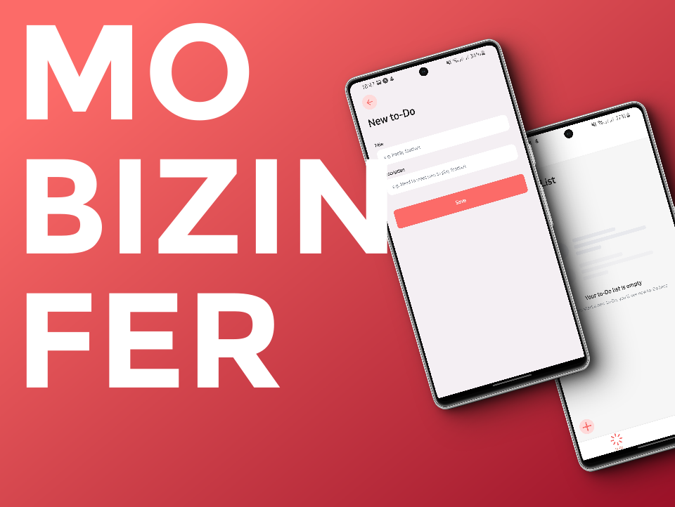
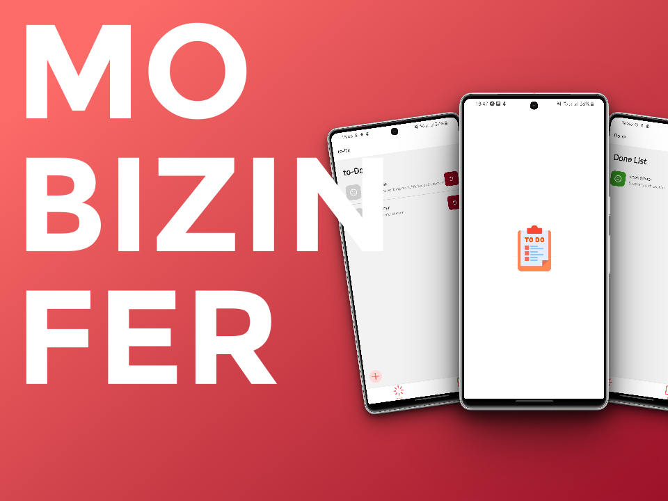

# MO BIZIN FER

"Mo bizin fer" in my native language means "I need to do". These three words inspired me to create a todo app using React Native Expo as a starting point to demonstrate my understanding and proficiency in React Native.

The todo app helps me to introduce myself to React Native state management using Zustand and SQLite for local storage on Android phones. Although better navigation could be achieved using Expo Router, due to my limited knowledge in React Native and available APIs on Expo, I utilized basic navigation.

Below are some commands to run the code:

```
npm install
npm run start
```
 
Install Expo-app and scan the QR code with your android device connected on the same network as the computer compiling the code.

Some screenshots of the app:




